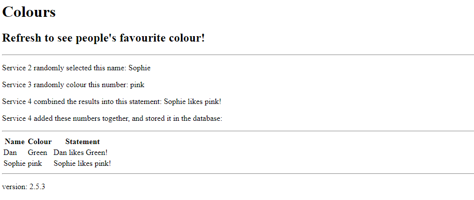

# Project Overview
Author: Daniel Brownless

## Introduction

This is a simple 4-part micro-service web-app, built using Python Flask api.

The focus of this project was the implementation of my Pipeline, and acheiving to acheive Continuous Integration and Deployment.

My app:
&nbsp;

&nbsp;

## micro-services
* Service 1 handles the front end. Services 2 and 3 and 4 act as the backend.

* Upon arrival at the 'homepage', service 1 sends a GET request to service 2.
* In response, Services 2 and 3 randomly select a name, and colour from a list, and return this to service 1.
* Service 1 sends this information to service 4, where it is combined into a statement, and returned to service 1.
* Service 1 then sends all the data back to service 4, where it is persisted in the database.
* Service 4 then reads the current contents of the data base, and returns it to service 1.
* Finally, Service 1 renders a HTML template, displaying all of the information.
* Data is transferred between services as JSON.

## Tools and Technologies
### My Technology Stack
* Project **Planning: Trello**
* IDE: **VSCode**
* Cloud Server: **GCP Compute Engine**
* Database: **GCP SQL Server**
* Programming Languages: **Python, HTML**
* Frameworks: **Flask API**
* Version Control: **Git**
* Version Control System: **GitHub**
* Orchestration Tool & Containerisation: **Docker**
* CI Server: **Jenkins**
* Automated Testing: **Pytest**
* Build Tools: Jenkins, **Docker**
* Artifact Repository: **Dockerhub**
* Config Managment: **Ansible**/
* Deployment: **Docker Swarm**
* Load Balancer: **Nginx**

&nbsp;

&nbsp;

#### **Test**
* Unfortunatley, I was unable to get my unittesting to pass successfully.
* In the interest of showcasing the rest of my pipeline, I have commented out the test commands from the 'testing' bash script.
#### **Build**
* To build my code, I used Docker-compose.
#### **Push**
* Having built the images in the previous stage, the images are tagged, and pushed to my artifact repository (dockerhub).
* The sensitive login details for Dockerhub are handled here using jenkins secret text, preventing exposure.
#### **Config**
* I configured my live environment using Ansible.
* My ansible configuration is described below.

#### **Deploy**
* In this stage, the 'deploy' bash script is run, which copies the docker-compose file into the swarm-manager node.
* The script also sets the jenkins secrets (database uri, version and the number of replicas for each service) as environment variables on the swarm-manager node.
  * This allows each service to access the information when needed.
* finally, the application is deployed using 'docker stack deploy', passing in the location of the docker-compose file from earlier.
  * This command pulls the images, with the current version tag, from dockerhub, and uses them to create containers, which are allocated accross the swarm.
#### **Comments**
* I have also implemented a 'rollback' parameter, giving the ability to deploy the application using an older image.
  * When set to 'true', the **test**, **build** and **push** stages are ommitted (unnecessary, due to an older image being used).
  * This feature gives me the ability to quickly revert to a stable build if the application crashes, or the build fails.
* I have implemented a 'version' parameter, allowing for image-versioning in the **build** and **push** stages.
  * For clarity, the image version is displayed in the html of service 1.
* My secrets are handled using Jenkin's credentials management
  * My database URI, Dockerhub username, and Dockerhub password are set on Jenkins.
    * These are then referenced, and passed through to my docker compose file, so that:
      * The **push** stage has access to the artifact repository
      * The images are built with the correct database uri, and the app can run with database access.
### Docker
* I am using docker as my orchestration and containerisation tool.
* This allows me to package up my application, with all its dependencies in a self-contained, ready-to-run package.
* Each service has its own 'Dockerfile', defining the build process for its image.
* A docker-compose file is then used, allowing me to orchestrate the builds for all 4 images with a single command.
* The 'docker-compose' console command is used for the build stage, to create the images for each service in single command.
  * Having passed in the version tag, and number of replicas.
* The 'docker push' command is used to push all my built images to the artefact repository.
* In the config stage, I use ansible to configure the docker swarm nodes (See below)
* Finally, Docker Swarm is used in the **deploy** stage, with the 'docker stack deploy' command being used to run the application.

* Docker-C
### Ansible
* I use Ansible here as a configuration management tool, to prevent deviation from the desired state of my deployment environment (environment drift).
* Each time this stage is ran, Ansible ensures the configuration of each machine matches specified configuration.
* Ansible is managing 4 nodes, split into three groups:
  * 'managers' group
    * 'manager' node
  * 'workers' group
    * 'worker1' node
    * 'worker2' node
  * 'nginx' group
    * nginx machine
* My ansible roles are defined as follows:
  * 'docker' - install docker, with dependencies, set jenkins as a user.
    * applied to the 'managers' and 'workers' groups.
  * 'manager' - initialise swarm.
    * applied to the 'managers' group
  * 'workers' - join swarm
    * applied to the 'workers' group
  * 'nginx' - install nginx and configure as a load balancer
    * applied to the 'nginx' group.

### Nginx
* In this project, I am using Nginx in my live envornment as a load balancer.
* Nginx listens at port 80, and redirects the user to the swarm node that currently has the least connections.
* This ensures that all instances of my application are evenly distributed accross my swarm nodes, preventing any one machine from being overloaded.
* My swarm nodes are configured so that users can only connect to the app through nginx.

### Database - Entity Relationship Diagram

My database consists of one table:
**Colour_Statement**
Column       | Evaluation |
------------ | -------------
id           | Integer Primary key, not-null, auto-increment
name         | String, not-null
colour       | String, not-null
statement    | String, not-null
&nbsp;

## Testing
Unfortunatley, I was unable to get my unit-testing to pass successfully.
I configured this stage so that each service would be tested in isolation.

The 'testing' bash script sets up a 'testing' virtual environment, and installs the required dependencies, and then tests each service in isolation. It then cleans up: deactivating and removing the virtual environment.

## Risk Assessment
| Description | Evaluation | Likelihood | Impact | Responsibility | Response | Control Measures |
|-|-|-|-|-|-|-|
| Personal pc crashes during vital task | Loss of uncommitted changes | Low | Medium | Developer | Restart and start again from most recent commit | Ensure work is frequently committed and pushed to the remote repo. |
| GCP VM Crashes | Loss of time; potential data corruption | Low | Low | GCP | Restart / setup new VM, and start again from most recent commit. | Ensure work is frequently committed and pushed to the remote repo. Ensure VM isn't over-worked by too running too many instances of my application. Keep an eye on docker services. Regularly clear unwanted images and containers. Keep a note of VM config settings |
| Database server goes down | Potential Loss, or corruption of Data | Low | Low | GCP | Restart / setup new server, repopulate data. | Keep a note of database server config settings |
| Broken source code is committed and Built | Build failure, or potential application crash. Loss of time | High | Medium | Developer | Revert back to a stable commit, and rebuild the application. | Pursue test-driven development to prevent 'broken builds'.  Add Web-hooks to Remote Repo at a late stage, once I know source code is stable. |
| Sensitive information is pushed to remote repo (e.g. db keys, passwords) | Risk of potential DDOS, MitM or SQL injection attack | Low | High | Developer | Remove commit from remote repo. Make sure secrets are stored correctly in Jenkins  | Ensure that my database URI and Dockerhub login details are secured, using Jenkins'  secret management, and OS environmental variables. |
| Dependencies (e.g. python packages, tools / languages) are updated | Incompatibilities between components may result in the application crashing, or build failing. | Medium | High | Developer | Recreate virtual environment. Troubleshoot source code to find the correct versions for dependencies. | Ensure that I keep note of correct versions for dependencies.  Store python-package requirements with versions in 'requirements.txt' files. Keep an eye out for any updates. |
| SSH key is accidentally lost. | Inability to connect to VM's, with a potential loss of any configurations I had setup there. The inability of Jenkins to connect to swarm will result in a deployment failure. | High | Medium | Developer | Delete, and generate a new SSH key, adding the public key to the relevant GCP machine. Before 'building' ensure that Jenkins can ssh into the swarm manager. | Ensure that I keep note of any configurations that might be lost. |
| GCP VMs or database servers change IP address. | Inability to connect to VM's via old IP. Swarm will be unable to connect to database, crashing the application. Jenkins may be unable to connect to swarm. | High | Low | Developer | Connect via the new IP address. Update database URI with the new IP adress. | Ensure that database uri uses the private IP for database server. Ensure that VM's are all in the same private network (same Zone on GCP), so that I can refer to machines by their names. |
| Run out of GCP credit. | I will be unable to host my application an pipeline on GCP, or I will be charged suddenly. | Low | High | Developer | Ensure payment is setup properly, and pay for GCP usage. | Keep an eye on my GCP Credit usage.  Ensure that expensive services, e.g. SQL server operations & data  storage are kept to a minimum. Switch off VM's at night. |

## Project Planning

## References
Most of my Jenkins, Docker, and NGINX was written with the help of Jordan Grindrod and Dara Oladapo: 

https://github.com/DaraOladapo/chaperoo-todo-client

My ansible scripts were largely based on those written by Harry Volker: 

https://github.com/htr-volker/animal-noises
